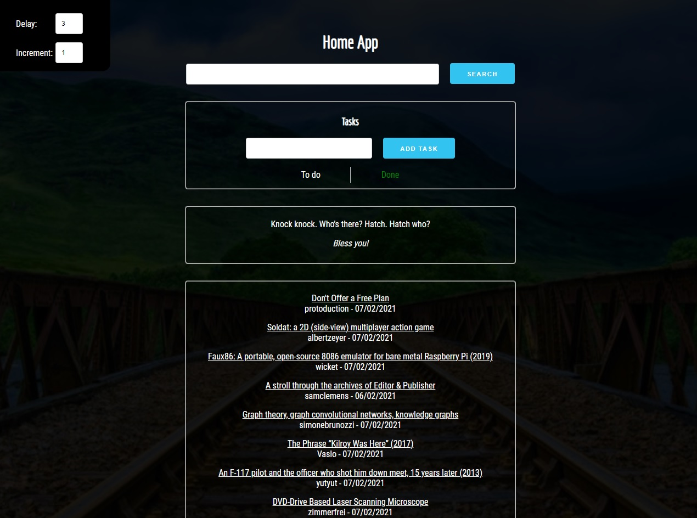

# Home App

React Hooks are the biggest update to React.
I took to this project as a chance for me to study how they work under the hood, making me more comfortable with functional components as oposed to class-based.

## What is this?

It's a simple app that should work as a start page for the browser, it's comprised of a google search bar, a task/todo list that uses the browser local storage, changing pictures for background, a jokes section, and a listing for the lastes news using the hacker news API

### Used hooks

`useState` - a hook that allows you to attach local state data to your components.

`useEffect` - a hook that allows you to apply side effects to your components, that fire conditionally based on parameters.
The first parameter is the function that is going to be executed.
The second parameter is an array of values, which tell React when to fire the function. If a value has changed between renders, React will fire the callback. This means that
if you only want the function to fire after the initial render you can supply an empty array.

Custom hook - `useFetch` - a hook that uses the Fetch API to get a JSON result and then return it in array.

Custom hook - `useDynamicTransition` - a hook used to return an index that keeps increasing after an provided amount of time.

`useReducer` - in a very very broad way you could say that it's a `useState` on steroids, but even describing as this doesn't begin to cover it how usefull this pattern is. So, I'm going to explain its structure following its flow: it uses a _Store_ to store the initial data, a _Reducer_ is pretty much a function that is going to be called by an _Action_ that then hits the store and does the intended changes, I found this image that cleared it up for me:

### Creating custom hooks

This is easily the best feature from hooks for me. When I have two components with similar logic, I can just create a custom reusable hook. However, the trickies part is to find the differences in logic and then turn those into parameters.

## What does it look like?

